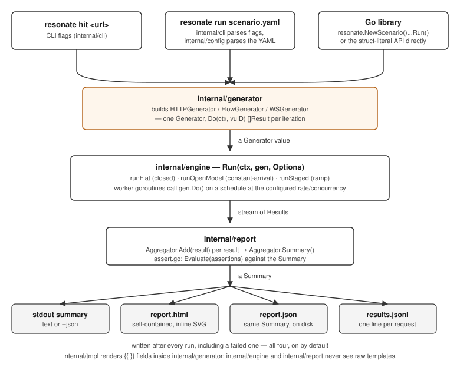

# Architecture

A quick map of the codebase for anyone extending resonate.

**Request flow:** `cli` parses flags/YAML → builds a `generator.Generator`
(`HTTPGenerator`, `FlowGenerator`, or `WSGenerator`) → hands it to
`engine.Run` → `engine` drives the generator at the configured
concurrency/rate, streaming `generator.Result`s into a `report.Aggregator` →
`report.Summary` is printed (text or `--json`) and written to the four
report formats (see [Reports](reports.md)).

- **root package (`resonate`)** — a thin, deliberately small public facade
  over `generator`/`engine`/`report` (type aliases + one-line wrapper
  functions), for embedding resonate's engine in your own Go program
  instead of going through the CLI/YAML. `dsl.go`'s `Scenario` is the one
  exception that isn't a pure passthrough — a fluent builder with its own
  state (which request/message is "current," a control-flow block stack
  for `Repeat`/`During`/`If`) layered on top of the same facade, covering
  HTTP targets, multi-step flows, and WebSocket. See [Library](library.md)
  and the standalone `examples/dsl-examples` project (`full-scenario` plus
  one demo per execution model).
- **`internal/generator`** — protocol-agnostic `Generator` interface plus the
  `HTTPGenerator` (independent requests), `FlowGenerator` (multi-step,
  response chaining, per-worker identities), and `WSGenerator` (WebSocket
  connection lifecycle) implementations.
- **`internal/tmpl`** — per-request templating (`{{ }}` expressions) for
  URLs, query params, headers, and bodies. See
  [Request Templating](usage.md#request-templating).
- **`internal/engine`** — worker pool + rate limiter that drives a
  `Generator` for a configured duration/request count (flat, open-model, or
  a staged ramp schedule) and streams results; optionally bounds and
  rotates each virtual user's lifetime (`load.iterations`). See
  [Execution Models](execution-models.md).
- **`internal/report`** — aggregates results into latency percentiles,
  success rate, throughput, and status/error breakdowns; `assert.go`
  evaluates `assertions:` thresholds against a completed `Summary`.
- **`internal/config`** — YAML scenario file schema and loader. See
  [Scenarios](scenarios.md).
- **`internal/cli`** — Cobra commands (`hit`, `run`).
- **`cmd/gendocs`** — regenerates the [CLI Reference](cli/resonate.md)
  from the cobra command tree, so it can't drift from the actual flags.

For the deeper design rationale behind specific decisions (why
`runStaged` doesn't use `rate.Limiter.SetLimitAt`, the validation
philosophy, testing patterns used in each package), see
[`CLAUDE.md`](https://github.com/jecklgamis/resonate/blob/main/CLAUDE.md)
in the repo — it's written for anyone (human or AI) working on the code,
not just Claude specifically.
